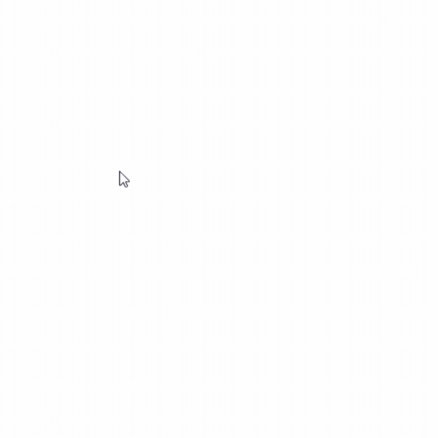

# Bouncy Bouncy
OpenGL GUI application that displays a smaller object bouncing around an outer boundary, where both object and boundary are drawn by the user. 



## Features
- Drawing tool for user to draw their own boundary and shape
- Keyboard arrow key input to modify speed and rotation of the object as it moves
- Object translates and rotates about its center according to angle of collision
- "Go Crazy" button for colorful fun :) (epilepsy warning***)

## Installation
To run this application, I used FreeGlut with Code::Blocks. Below are the steps to my setup.
1. Clone the repository:
   ```
   git clone https://github.com/mctripp10/bouncy-bouncy.git
   ```
   
2. Download [Code::Blocks](https://www.codeblocks.org/) 
3. Download [FreeGlut for MinGW](https://www.transmissionzero.co.uk/software/freeglut-devel/)
4. Follow the steps under "Installation" [here](https://wiki.codeblocks.org/index.php/Using_FreeGlut_with_Code::Blocks) to finish project setup and link everything properly
